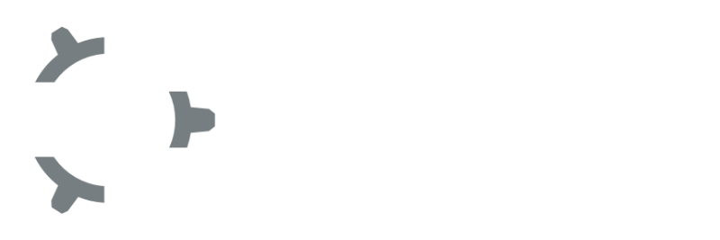

# Embed Club | P.A. College of Engineering

<div align="center">
  
  <p align="center">
    <strong>A student-led self-learning club dedicated to Embedded Systems and IoT at PACE</strong>
  </p>

  [](https://nextjs.org/)
  [](https://payloadcms.com/)
  [](https://neon.tech/)
  [](https://supabase.com/)
</div>

## About Us
Welcome to the IoT and Embedded Systems Club at **P.A. College of Engineering**. We are a group of passionate students and tech enthusiasts who share a common interest in embedded systems, IoT, and computer science. Our club provides a platform for students to explore, experiment, and create with technology through events, workshops, and projects.

### Foundational Team & Alumni
Embed Club emerged from the collective vision of its founding members: **Habeeb Ur Rehman**, **Nishant Narayanan**, and **Mohammed Saifuddin**. Our alumni play a vital role, leveraging industry experience to train current students in advanced technologies through workshops and mentorship.

Embedded system education is a challenge because it sits at the intersection of many disciplines. Embed Club is planned and managed by the students themselves, ensuring we stay close to industry requirements while learning consciously and actively.

### History
Embed Club was inaugurated on **14th November 2018 at PACE**. The club was founded with these core objectives:
- **Infrastructure**: Creating a community with infrastructure to help technical minds.
- **Knowledge Transfer**: Connecting experienced mentors and newbies to transfer knowledge.
- **Innovation**: Connecting like-minded technocrats to generate ideas, products, and technologies.
- **Open Lab**: Creating an Open Lab with the latest hardware and tools through community contributions.

### Activities
To meet the requirements from research and industry, we focus on six types of activities:
1.  **Discussion**: Sharing experiences among students to form a technology community.
2.  **Training**: Hands-on sessions to master knowledge consciously and actively.
3.  **Lecture**: Supplements to class, featuring specialists and senior engineers.
4.  **Project**: Collaborative work on real-world engineering challenges.
5.  **Contest**: Participating in and hosting technical competitions.
6.  **Research**: Opportunities for senior members to join advanced research groups.

---

## Project Overview

**Embed Club** is the IoT and Embedded Systems Club at **P.A. College of Engineering (PACE)**. We are a community of student tech enthusiasts dedicated to self-learning, collaboration, and hands-on innovation in the fields of embedded systems and computer science.

### Mission
We are dedicated to advancing knowledge and expertise in embedded systems and IoT. Our mission is to foster a community of passionate learners and innovators who collaborate, create, and make a positive impact through technology.

### Vision
Our vision is to be a leading hub for innovation in embedded systems and IoT. We aim to inspire and educate the next generation of engineers and problem solvers who will shape the future of technology.

### Get Connected!
Embed Club connects over **100+ members** who share a passion for embedded systems and innovation. Collaborate on groundbreaking projects, host tech events, and network with professionals in fields like Embedded AI, Real-time Systems, and IoT. Join us and be a part of something big!

## Project Structure

```text
/public       - Static assets (fonts, brand logos, etc.)
/src
  /app        - Next.js 15 App Router (Frontend & Payload Admin)
  /components - Reusable React components & Layouts
  /payload    - Payload CMS Config & Collections
  /lib        - Shared utilities and type-safe helpers
  /hooks      - Custom React hooks
```

### High-Fidelity Features

- **Intro Visual Identity**: A specialized **Shared Element Transition** (Logo Glide) that persists across page loads for a premium "App-like" feel.
- **"Solder & Copper" design system**: copper-on-graphite theme with a fabric texture, documented in `docs/DESIGN.md` / `docs/PRODUCT.md`.
- **Native Form Builder**: multi-step wizard forms built in Payload admin; submissions are stored locally AND forwarded to Google Forms so organizers keep working in Sheets.
- **Automated Media Engine**: Integrated **Sharp-powered WebP compression** and responsive image generation hosted on Supabase S3.
- **Relational Directory**: Sophisticated member profiles with hierarchical roles, categories, and achievement tracking.
- **Resource Hub**: A curated repository of tools, tutorials, and simulators with advanced tagging, search, and cutout-card UI.
- **Event Orchestration**: Full lifecycle management for workshops, meetings, and club activities — with optional registration forms.

---

## Architecture & Tech Stack

| Layer | Technology | Purpose |
| :--- | :--- | :--- |
| **Frontend** | Next.js 15 (App Router) | Core application routing and SSR/ISR |
| **Backend/CMS** | Payload CMS 3.0 | Headless content management & headless API |
| **Database** | Neon (PostgreSQL) | Serverless relational database, migration-managed |
| **Storage** | Supabase (S3 Compatible) | Cloud media storage (prod only, via `USE_S3_STORAGE`) |
| **Motion** | Motion (motion/react) & GSAP | High-fidelity UI animations and transitions |
| **Styling** | Tailwind CSS 3 | Copper design tokens + utility layout |

## Deployment

This project is optimized for deployment on Vercel or similar platforms. 

### Build Process
The build command in `package.json` includes critical steps for Payload 3.x:
1.  **Database Migrations**: `pnpm run payload migrate` runs automatically to sync the database schema.
2.  **Import Map Generation**: `pnpm run generate:importmap` creates the component mappings required for the Admin Panel.
3.  **Next.js Build**: Standard `next build` for the application.

### Environment Variables
Ensure the following are set in production:
- `DATABASE_URL`: Neon/Postgres connection string.
- `PAYLOAD_SECRET`: A secure random string.
- `S3_*`: AWS/S3 credentials for media storage.

## Getting Started

Full instructions live in **[docs/SETUP.md](docs/SETUP.md)** — environment, database
migrations, content model, deployment, and troubleshooting. TLDR:

```bash
pnpm install
# create .env (see docs/SETUP.md §3)
pnpm payload migrate
pnpm dev            # http://localhost:3000  (+ /admin)
```

### Daily commands

| Command | Purpose |
|---|---|
| `pnpm verify` | biome + typecheck + integration tests — run before every commit |
| `pnpm verify:full` | verify + production build + Playwright e2e — run before merging |
| `pnpm generate:types` | regenerate Payload types after schema changes |

## Contributing

1. Read **[AGENTS.md](AGENTS.md)** first — it defines the design language,
   naming conventions, and hard rules. It applies to humans and to any AI
   coding assistant you use.
2. Branch from `main`: `git checkout -b feature/your-feature-name`
3. `pnpm verify` before every commit; `pnpm verify:full` before the PR.
4. Never push directly to `main` — it auto-deploys and migrates the production
   database.

---

<p align="center">
  Built with ❤️ by the Embed Club Engineering Team.
</p>